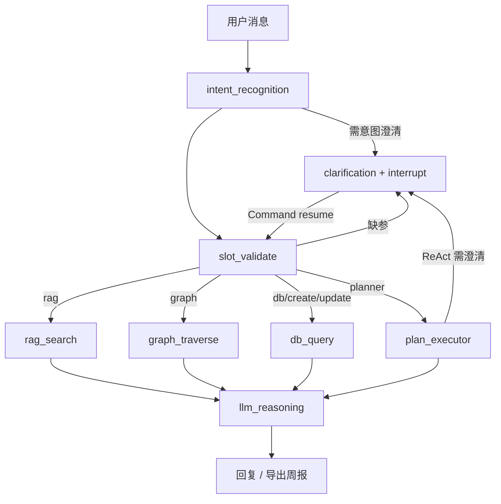

# 智能任务协同 Agent 系统

基于 **LangGraph + LangChain** 的企业级智能协同平台：混合存储（MySQL / Chroma / Neo4j）、**意图路由 + 槽位填充**、**RAG 知识检索**、**跨请求澄清（interrupt + checkpointer）**，以及 **周报生成（Planner 主路径 + ReAct 兜底）**。

> 定位：**生产导向的 Agent 工程样板**（架构与链路完整，业务数据部分为 Mock，适合演示与面试讲解）。

## 功能特性

### 1. 智能对话（Agent 核心）

- **LangGraph 状态机编排**：意图识别 → 槽位校验 → RAG / 图谱 / DB / Planner → LLM
- **多轮对话**：MySQL 持久化 `conversations` / `messages`（P0）
- **槽位填充（P1/P2）**：路由前 + 业务代理入口二次校验，缺参追问
- **跨请求澄清（P3/P4）**
  - P3：Redis 存储澄清快照（多实例共享，可回退内存）
  - P4：`clarification` 节点内 `interrupt()` + **Checkpointer**（`Command(resume=...)` 续跑，避免重跑 RAG）
- **SSE 流式**：预处理图在 `llm_reasoning` 前中断，真实 token 流式输出
- **推理过程可视化**：`reasoning_steps` 随响应返回
- **周报导出（Planner）**：检索撰写规范 → 汇总任务/执行内容 → LLM 生成 → 导出 Markdown（P5 前端下载）

### 2. 任务 / 项目协同

- 任务与项目 CRUD、列表查询（API + Mock 业务代理）
- 执行分工、评分相关意图与槽位

### 3. 知识库（RAG）

- Chroma 向量检索，租户隔离
- 查询改写 / 扩展、BM25 混合检索、可配置精排（lexical / cross-encoder）
- 内置《员工周报撰写规范》文档，支持脚本入库

### 4. 知识图谱（可选）

- Neo4j 员工-任务-项目关系查询（未启动时降级演示）

### 5. 监控与成本

- Token 用量落库、预算预警
- 意图链路 LLM 用量统计

## Agent 工作流



**设计原则（面试可讲）**

| 比例 | 策略 |
|------|------|
| ~80% | 固定图路由 + 槽位 + 业务代理 |
| ~20% | 周报等复合任务：Planner 四步；观测异常时 ReAct 追问（0 任务 / 多项目 / 无执行内容） |

## 技术架构

```
┌──────────────────────────────────────────────────────────────┐
│                     前端 (React + Vite)                       │
│   对话(SSE) | 澄清提示 | 周报下载 | 任务/项目/知识库/监控      │
└──────────────────────────────────────────────────────────────┘
                              │
                              ▼
┌──────────────────────────────────────────────────────────────┐
│                    FastAPI  /api/v1                           │
│   /agent/chat  /agent/chat/stream  /chat/conversations  ...   │
└──────────────────────────────────────────────────────────────┘
         │              │                    │
         ▼              ▼                    ▼
┌─────────────┐  ┌─────────────┐    ┌─────────────────┐
│ Intent      │  │ RAG Service │    │ Graph Service   │
│ Router      │  │ (Chroma)    │    │ (Neo4j)         │
└─────────────┘  └─────────────┘    └─────────────────┘
         │
         ▼
┌──────────────────────────────────────────────────────────────┐
│ LangGraph Agent (graph.py)                                    │
│  checkpointer.py + runner.py (invoke / resume)                │
│  planner/  task_planner · plan_executor · react_fallback      │
└──────────────────────────────────────────────────────────────┘
         │
    ┌────┴────┬────────────┬──────────────┐
    ▼         ▼            ▼              ▼
 MySQL     Chroma       Neo4j          Redis
(对话历史) (向量库)    (图谱)    (澄清快照 + Checkpoint)
```

## 能力演进（P0–P5）

| 阶段 | 能力 | 关键模块 |
|------|------|----------|
| **P0** | MySQL 多轮消息持久化 | `conversation_service`, `models/conversation.py` |
| **P1** | 路由前槽位校验 | `slot_registry`, `slot_validation`, `slot_validate` 节点 |
| **P2** | 业务代理二次校验、去掉 Mock 默认参数 | `business_service_proxy` |
| **P3** | Redis 澄清 pending（多实例） | `clarification_store`, `session_manager` |
| **P4** | `interrupt` + `checkpointer` 跨请求续跑 | `checkpointer.py`, `runner.py`, `clarification_node` |
| **P5** | 前端澄清提示、周报 `export_path` 下载 | `ChatPage.tsx`, `chatApi.ts` |

验证运行时存储：

```http
GET http://localhost:8000/api/v1/agent/session/backend
```

示例响应：

```json
{
  "clarification_backend": "redis",
  "graph_checkpoint_backend": "redis"
}
```

> API 前缀为 **`/api/v1`**，不是 `/api`。

## 快速开始

### 环境要求

- Python 3.10+
- Node.js 18+
- **MySQL 8.0**（对话持久化，建议启用）
- **Redis 6+**（澄清 + Checkpoint，可选；未配置时回退内存）
- Chroma（本地 `./data/chroma_db`，首次启动可自动加载 bundled 文档）
- Neo4j 5.x（可选）

### 1. 后端

```bash
cd backend
pip install -r requirements.txt
cp .env.example .env
# 编辑 .env：至少配置 OPENAI_API_KEY、SECRET_KEY、MySQL

# 初始化对话表
python scripts/init_conversation_tables.py

# （可选）写入周报撰写规范到向量库
PYTHONPATH=. python scripts/seed_weekly_report_knowledge.py
```

### 2. Redis（推荐）

```bash
brew install redis          # 首次
brew services start redis
redis-cli ping              # 应返回 PONG
```

在 `.env` 中配置：

```env
REDIS_URL=redis://localhost:6379/0
```

可选安装 LangGraph Redis Checkpoint（未安装时使用内存 Checkpoint）：

```bash
pip install langgraph-checkpoint-redis
```

### 3. 前端（一体化部署）

```bash
cd ../frontend
npm install
npm run build
cp -r dist/* ../backend/static/
```

### 4. 启动

```bash
cd ../backend
uvicorn app.main:app --reload --port 8000
```

若端口占用：

```bash
kill $(lsof -t -i:8000)
```

访问：

| 地址 | 说明 |
|------|------|
| http://localhost:8000/ | 前端 |
| http://localhost:8000/docs | Swagger |
| http://localhost:8000/api/v1/agent/session/backend | 存储后端探测 |

### 5. 演示：周报生成

1. 对话输入：**帮我生成本周周报**
2. 若 Mock 数据含多项目，按提示回复：**全部项目总周报** 或 **单项目：企业协作平台**
3. 流式生成完成后，点击 **下载周报 Markdown**
4. 知识问答（走 RAG）：**周报怎么写**

## 配置说明（`backend/.env`）

```env
# LLM（支持 OpenAI 兼容接口，如 DashScope）
OPENAI_API_KEY=your-api-key
OPENAI_MODEL=gpt-4-turbo-preview
OPENAI_BASE_URL=                          # 可选

# MySQL（对话历史）
MYSQL_HOST=localhost
MYSQL_PORT=3306
MYSQL_USER=root
MYSQL_PASSWORD=your-password
MYSQL_DATABASE=enterprise_agent

# Redis（P3 澄清快照 + P4 Checkpoint）
REDIS_URL=redis://localhost:6379/0
CLARIFICATION_STATE_BACKEND=auto          # auto | redis | memory
CLARIFICATION_STATE_TTL_SECONDS=86400
GRAPH_CHECKPOINT_BACKEND=auto             # auto | redis | memory

# Neo4j（可选）
NEO4J_URI=bolt://localhost:7687
NEO4J_USERNAME=neo4j
NEO4J_PASSWORD=your-password

# JWT
SECRET_KEY=your-secret-key
```

## 主要 API

| 方法 | 路径 | 说明 |
|------|------|------|
| POST | `/api/v1/agent/chat` | 非流式对话 |
| POST | `/api/v1/agent/chat/stream` | SSE：`token` / `clarification` / `meta` / `done` |
| GET | `/api/v1/agent/session/backend` | 澄清 & Checkpoint 存储后端 |
| GET | `/api/v1/agent/exports/{filename}` | 下载周报 Markdown |
| DELETE | `/api/v1/agent/conversation/{id}/clarification` | 清除澄清与图 thread |
| GET/POST | `/api/v1/chat/conversations` | 会话与消息（MySQL） |

请求头（租户 / 用户上下文）：

```http
X-Tenant-Code: TENANT_DEFAULT
X-Employ-Code: E_DEFAULT
```

## 意图与路由（节选）

| 意图 | 说明 | 路由 |
|------|------|------|
| `weekly_summary` | 生成 / 导出周报 | `planner` |
| `rag_semantic` | 知识问答（如「周报怎么写」） | `rag` |
| `query_task_list` / `query_my_tasks` | 任务列表 | `db` |
| `create_task` | 创建任务 | `create` |
| `graph_traverse` | 员工关系图谱 | `graph` |
| `general_chat` | 通用对话 | `llm` |

澄清类型：`intent`（意图消歧）| `slot`（参数缺失）| `plan`（周报范围 / 时间）

## 项目结构

```
enterprise-agent-project/
├── backend/
│   ├── app/
│   │   ├── agent/
│   │   │   ├── graph.py           # LangGraph 节点与边
│   │   │   ├── checkpointer.py    # P4 Checkpoint（Redis / Memory）
│   │   │   └── runner.py          # invoke / Command(resume)
│   │   ├── api/
│   │   │   ├── agent.py           # /agent/chat、stream、exports
│   │   │   └── chat.py            # 会话 CRUD（MySQL）
│   │   └── services/
│   │       ├── intent/            # 意图模式（含 weekly.py）
│   │       ├── planner/           # 周报 Planner + ReAct
│   │       ├── slot_validation.py
│   │       ├── clarification_store.py  # P3 Redis
│   │       ├── conversation_service.py
│   │       ├── rag_service.py
│   │       └── business_service_proxy.py
│   ├── data/
│   │   ├── chroma_db/
│   │   ├── exports/               # 导出的周报 .md
│   │   └── rag/docs/weekly_report_writing_guide.md
│   └── scripts/
│       ├── init_conversation_tables.py
│       └── seed_weekly_report_knowledge.py
└── frontend/
    └── src/pages/ChatPage.tsx     # SSE、澄清提示、周报下载
```

## 权限与成本（概要）

- **租户隔离**：请求头 `X-Tenant-Code`；RAG 检索带 `tenant_id` 过滤
- **权限交集**：向量元数据过滤 + 业务层鉴权（设计原则，部分模块为演示实现）
- **成本治理**：Token 落库、日/月预算比例预警、按意图/模型分布统计

## 生产化路线图（待完善）

- [ ] 业务代理对接真实微服务（超时、熔断、重试）
- [ ] pytest 覆盖意图 / 槽位 / 澄清 resume 集成测
- [ ] 统一鉴权（JWT / 网关）与请求限流
- [ ] K8s 部署、健康检查、密钥托管
- [ ] 向量库与 Checkpoint 托管化

## License

MIT
